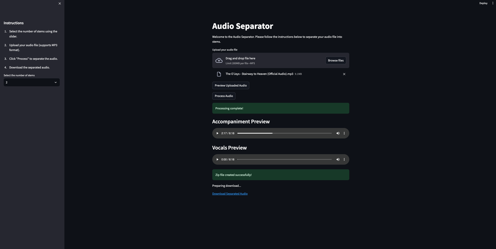

# Audio Separator

This is an application that separates audio files into stems using the Spleeter library. It's built with Python and
Streamlit.



## Features

- Select the number of stems (2, 4, or 5)
- Upload your audio file (supports MP3 format)
- Separate the audio into stems
- Download the separated audio

## Installation

1. Clone this repository
2. Install the required packages

```bash
pip install -r requirements.txt
```

3. Run the Streamlit app

```bash
streamlit run main.py
```
